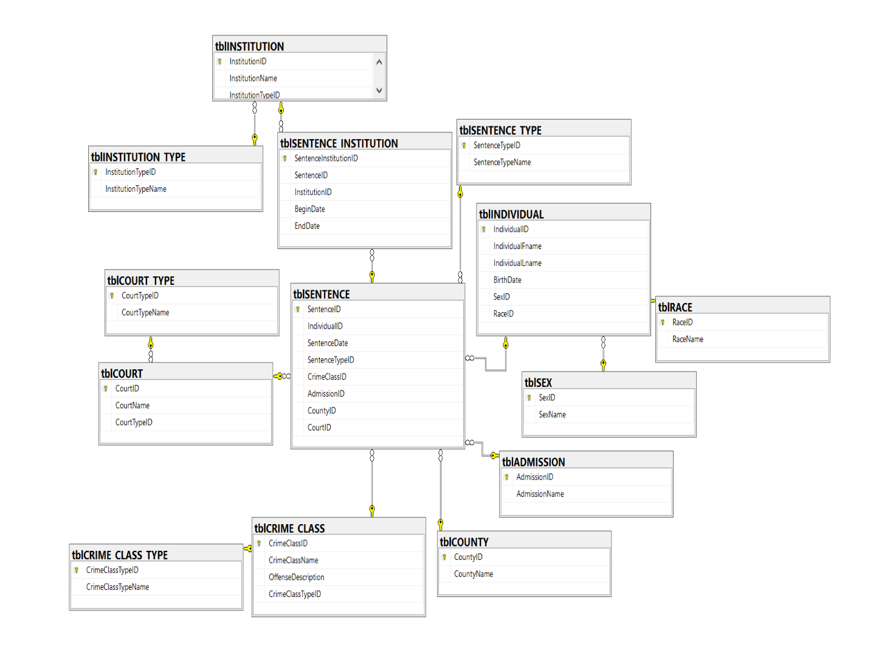

# wa-court-sql-server
## Authors: Travon Dao, Connor Fink, Muhammad Rahman

The topic we chose for our database space is an analysis of incarceration trends. Incarceration rates are a major problem in the U.S. - the U.S. consists of 5% of the world’s population but houses 50% of the world’s prison population. The prison population demographic is a reflection of racial inequality imposed by the prison industrial complex, disproportionately affecting African-American and Latinx communities specifically.

Generational poverty persist from the era in which overt discrimination against minority groups confined them to poorly funded areas. Lower socioeconomic status is a high predictor of crime. Discrimination in the judicial system pose a threat as well. Not only do police arrest minorities at a higher rate, but African-Americans, Latinos, and Native Americans are more likely to be convicted, and to have longer sentences compared to their white counterparts. Such inequalities in the prison system strengthen racial stereotypes and lead to increased racial disparity. These stunt the growth of certain minority groups by limiting their opportunities as well as leaving them in less desirable socioeconomic situations. Hence, the cycle of poverty and crime continues.

This leads to our main problem statement: Which areas in the US show high incarceration rates, and in said areas, are African-American and Latino populations overrepresented? Among regions, states, and the different types of counties (categorized by their size), we intend to analyze which areas exemplify the most racial bias in incarceration.
The typical users of the database would be government and/or public service workers. Policymakers and government officials could use it as a springboard to investigate the issue in the hopes of reducing racial discrimination in incarceration. For example, they may place new policies to ensure that law enforcement does not overly target marginalized groups. Furthermore, they could direct more funding and support to underserved communities which have higher incarceration rates, therefore giving more access to social mobility and preventing the turn to crime in the first place. This data would be of interest to non-profit organizations and public health experts as well - high poverty and crime rates have adverse effects on public health, with inhabitants of the area being more prone to suffer from health problems and injuries.

Some of the decisions that the aforementioned users will make based on the database will be as policy makers. Backed by data, they will be able to enact effective political change to reduce discrimination in the justice system. Data allows objective and quantitative viewing of discrepancies in society, which then helps validate marginalized experiences. Societal issues are less likely to be ignored with real data tailored to each community readily available. With new policies in effect, there will be a reduced incarceration rate, proportional to the U.S. population. Such effort will also further the cause of achieving racial justice for minority groups.